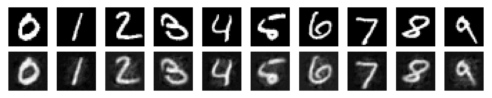
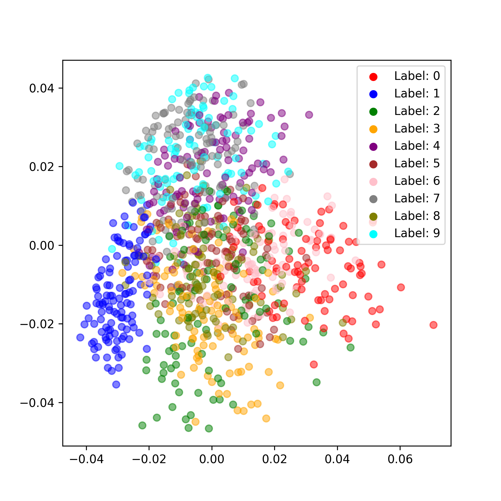

# Predictive coding tutorial in Pytorch
This is the companion repo for the tutorial [toddmorrill.github.io](https://toddmorrill.github.io/machine%20learning/unsupervised-predictive-coding/).

This repository has been forked from [Rafal Bogacz's group](https://github.com/ToddMorrill/PredictiveCoding).

## Usage
Follow the next steps to clone the code and setup the necessary python libraries:

```bash
python3 -m venv .venv
source .venv/bin/activate
pip install -r requirements.txt
```

Log into your wandb account from the command line if you want to track the run.
```bash
wandb init
```
If you don't want to use wandb then in `train.py` within `config` in the `main` function, enable `'mode': 'disabled'` and disable `'mode': 'online'`.

## Training unsupervised models
To train an unsupervised predictive coding model with the default parameters run
```bash
python train.py
```

Check the analysis directory for some artifacts produced by the run such as some sample generated images and a PCA embedding of the learned representations.



